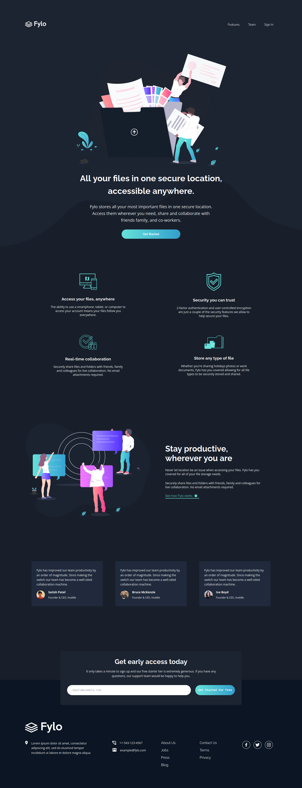

# Frontend Mentor - Fylo dark theme landing page solution

This is a solution to the [Fylo dark theme landing page challenge on Frontend Mentor](https://www.frontendmentor.io/challenges/fylo-dark-theme-landing-page-5ca5f2d21e82137ec91a50fd). Frontend Mentor challenges help you improve your coding skills by building realistic projects. 

## Table of contents

- [Overview](#overview)
- [The challenge](#the-challenge)
- [Screenshot](#screenshot)
- [Links](#links)
- [My process](#my-process)
- [Built with](#built-with)
- [What I learned](#what-i-learned)
- [Continued development](#continued-development)
- [Useful resources](#useful-resources)
- [Author](#author)

## Overview

### The challenge

Users should be able to:

- View the optimal layout for the site depending on their device's screen size
- See hover states for all interactive elements on the page

### Screenshot

### Links

- Solution URL: [https://fylo-dark-theme-landing-page-alpha-two.vercel.app/](https://fylo-dark-theme-landing-page-alpha-two.vercel.app/)
- Live Site URL: [https://fylo-dark-theme-landing-page-alpha-two.vercel.app/](https://fylo-dark-theme-landing-page-alpha-two.vercel.app/)

## My process

### Built with

- Semantic HTML5 markup
- CSS custom properties
- Flexbox
- CSS Grid
- JavaScript
- Mobile-first workflow

### What I learned

With this project I was able to practice what I have learned about HTML, CSS and JavaScript, paying close attention to the semantics of HTML and Applying CSS Flexbox and Grid, as well as using CSS positioning.

### Continued development

One way to improve the project would be adding data dynamically, and maybe using some javascript framework like Vue, React, Angular or Svelte.

## Author

- Frontend Mentor - [@jrag-dev](https://www.frontendmentor.io/profile/jrag-dev)